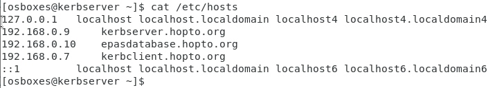
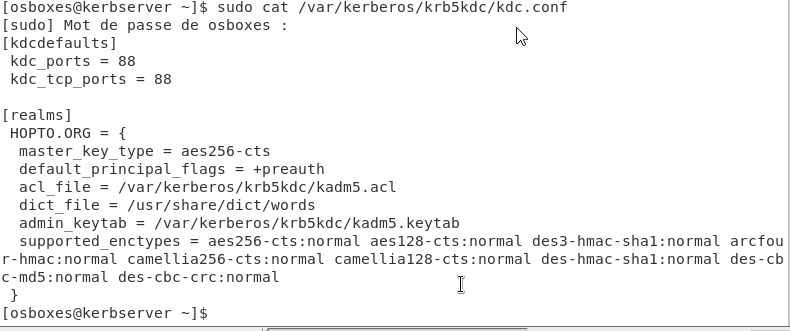
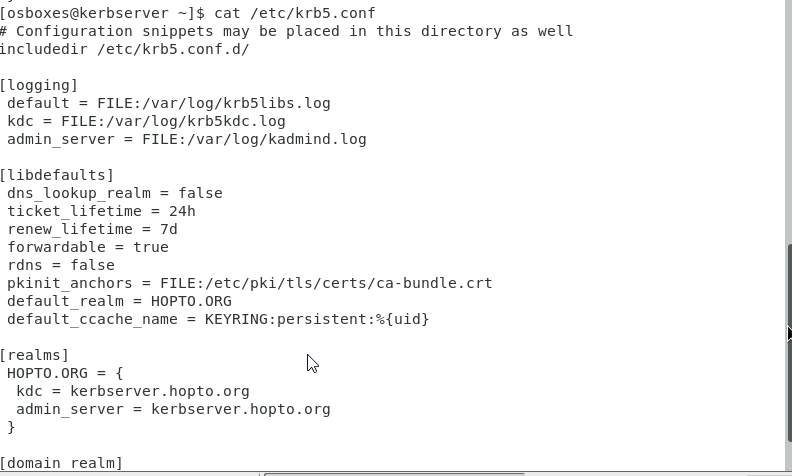
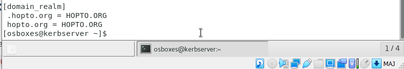
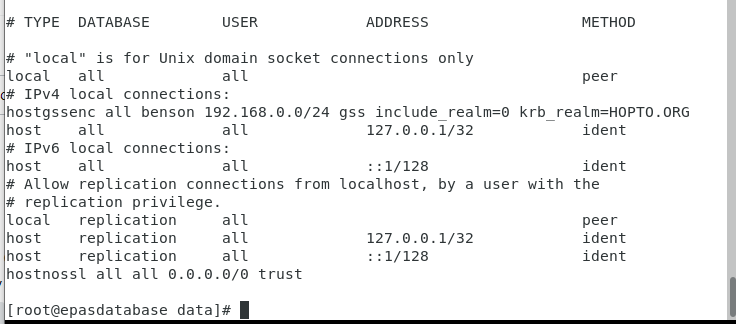
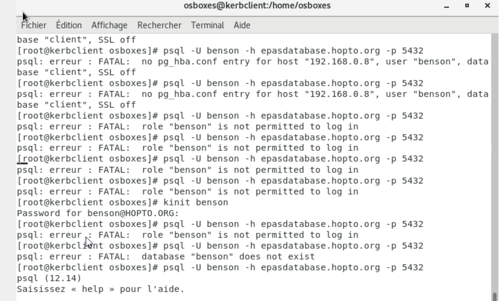

# Kerberos-tp
project desccription: configuring kerberos to authenticate a user to postgreSQL service .  

## WHAT IS KERBEROS:
Kerberos is a network authentication protocol designed to provide secure authentication for client/server applications by using secret-key cryptography. It was developed by the Massachusetts Institute of Technology (MIT) in the 1980s and has since become a widely-used protocol in enterprise environments.
## ARCHITECTURE:
We have three instances : 

- kerberos server (authentication server + ticket granting server).

- PostgreSQL server(plays the role of service to access).

- Client.

## SOME KERBEROS TERMINOLOGY
- Realm: A realm in Kerberos is a logical grouping of networked computers, services, and users that share a common authentication database, identified by a unique realm name.

- Principal: a principal is an entity (a user or a service) that is identified by a principal name, consisting of a primary component and a realm. Each principal is issued a secret key that is used to authenticate them when accessing network resources.

- KDC: KDC stands for Key Distribution Center, which is a trusted third-party authentication server that issues and manages authentication tickets and secret keys used by principals to access network services.

- TGT: TGT stands for Ticket-Granting Ticket, which is a type of ticket issued by the Key Distribution Center (KDC) to a principal after successful authentication. The TGT can be used by the principal to obtain other tickets, including service tickets, without the need for further authentication. The TGT is encrypted with the principal's secret key and includes a time stamp and other information that is used to enforce ticket expiration and limit ticket reuse.

- Keytab: a keytab is a file that contains one or more secret keys for one or more principals. The keytab is typically used by services to authenticate with the Key Distribution Center (KDC) and obtain service tickets without requiring interactive user input. The keytab file is encrypted with a master key that is known only to the KDC and the keytab owner, and is usually stored on the file system of the service's host machine.

- Client : a workstation that needs to access a Service in the kerberos realm.

## STEPS
1. the firewall should be stopped for all instances, in order to do that use this command on all instances:
`Systemctl stop firewalld`
2. For all instances check the IPs of the instances and 
edit the /etc/hosts for better readability (you can check your ip in the network with `ìfconfig` on the cli)

### KDC server configuration :

3. Let's install krb5 server and client:
`yum install krb5-server krb5-workstation pan_krb5`
4. go and edit the file '/var/kerberos/krd5kdc/kdc.conf'
and make sure it looks like this : (you can pick the realm name you want as long as you stay consistent )

5. go and edit the file /etc/krb5.conf:
 

6. go and edit the file /var/kerberos/krb5kdc/kadm5.acl (our access control list file) to */admin@HOPTO.ORG to make sure the admin user can connect with default privileges.
7. Kerberos DB: stores Principal information, including names, secret keys, and attributes, policy information, such as password policies, lockout policies, and ticket policies, Realm information, such as realm names, master keys, and trust relationships with other realms
Let's create a kerberos database :) :
`kdb5_util create -s -r HOPTO.ORG`
and you will be prompted to enter the database password
8. Let's start the services krb5kdc and the kadmin:
`systemctl start krb5kdc kadmin`
9. let's enter to kdc as the root, use this command: `kadmin.local`
10. let's add our needed principals (and enter password for that principal):
`addprinc root/admin`
`addprinc benson` (this will be our client for postgreSQL)
and let's add the postgreSQL service:
`addprinc postgres/epasdatabase.hopto.org` (a special for supported by GSSAPI :)
11. Now we need to extract the keytab file
`exit` (from the kadmin.local)
`kutil` (enter the service for keytab file)
`add_entry -password -p postgres/epasdatabase.hopto.org -k 1 -e aes256-cts-hmac-sha1-96` (to extract the key for this service :) ) 
12. Now we need to write it to the keytab file
`wkt postgres.keytab` (postgres is the name of keytab)
13. you need now to copy the keytab file to postgreSQL server (use cp to do so.)
### postgreSQL server configuration :
1. Let's go to the postgres.conf file and search for KRB
and make sure you go to the #GSSAPI using Kerberos line 
and uncomment krb_server_keyfile and link it to the keytab that you transfered from the kdc server.
2. stay on that file , check for # - Connextion Settings line and make sure listen_addresses equals to '*' and the port is 5444.
3. now save and exit :).
4. now go to the pg_hba.conf (the postgresql client auth conf file.)
5. make sure it looks like this: (this modification ensures that benson client can access to the database from outside this instance.)

### client server configuration:
1. let's install kerberos client to make sure that we can interact with our environment:
`yum install krb5-workstation pam_krb5 -y`

2. make sure that kr5.conf file looks like the one in the kdc server.

3. Now let's get a ticket from the kdc (with this command):
`kinit benson`

4. Now the final step! we connect to the postgreSQL server with this command : 
`psql -h epasdatabase.hopto.org -U benson`

